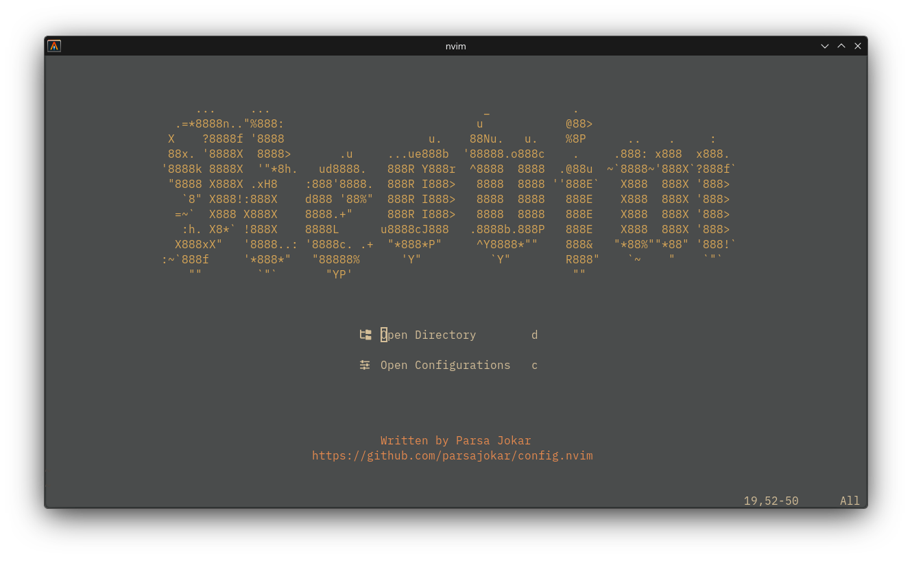

# Neovim Configuration by Parsa Jokar

> ⚠️ Disclaimer: I’m not a Neovim guru. This is just how I use Neovim personally. It works for me, but may need adjustments for your setup.



## Requirements

- fzf
- fd
- ripgrep
- tree-sitter-cli

## Installation

Clone this repository into your Neovim configuration directory:

```bash
git clone https://github.com/parsajokar/config.nvim ~/.config/nvim
```

Make sure to run this to see if everything is running properly:

```vim
:checkhealth
```
